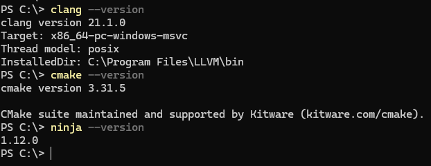
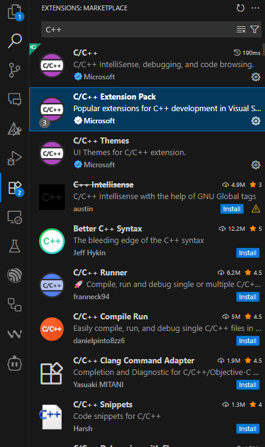
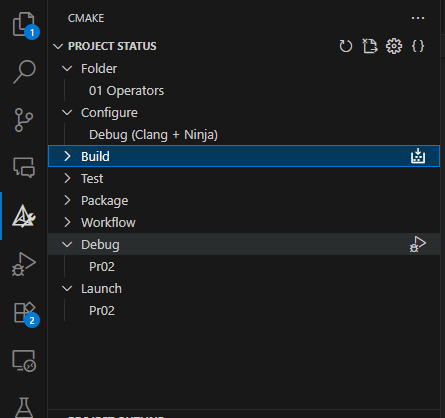

# Environment Setup (Clang, CMake) — macOS, Linux, Windows

This guide shows how to set up a C/C++ build environment using Clang and CMake.

## Windows (PowerShell)

1) You should have installed last stable versions of the tools.

- Clang: https://releases.llvm.org/
- Ninja: https://ninja-build.org/
- CMake: https://cmake.org/download/
- VSCode: https://code.visualstudio.com/download

2) Consider, you should add all the tools to PATH variable.
Here are the instructions for each OS:
- [Windows](https://www.architectryan.com/2018/03/17/add-to-the-path-on-windows-10/)
- [Mac](https://medium.com/@B-Treftz/macos-adding-a-directory-to-your-path-fe7f19edd2f7)
- [Linux](https://phoenixnap.com/kb/linux-add-to-path)

3) At this point, run the commands in terminal, they should print versions of the tools. If something fails, check PATH variable.


```sh
clang --version
cmake --version
ninja --version
```



4) Open VSCode and install C/C++ Extension Pack.



5) Build and run project using CMake Tools extension

- Click `Build` icon to build the project.
- Click `Debug` icon to run the project in debug mode. You should see output in console.




## Additional resources
- https://code.visualstudio.com/docs/cpp/cmake-linux
- https://github.com/microsoft/vscode-cmake-tools/blob/main/docs/README.md